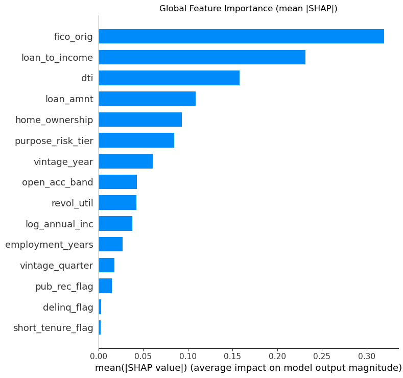
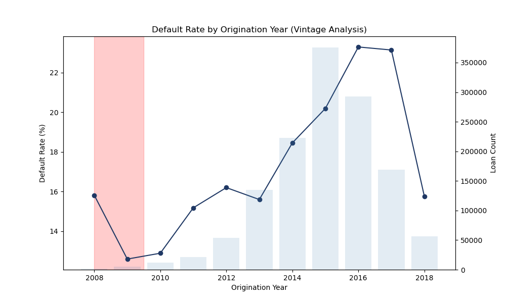
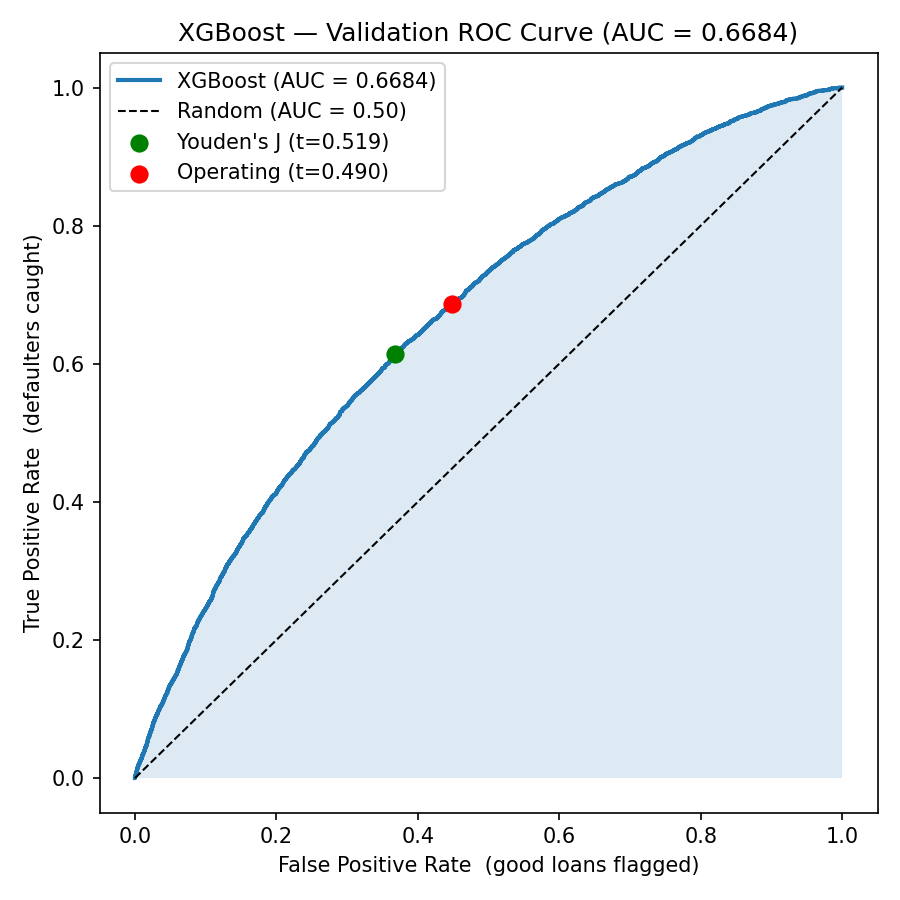
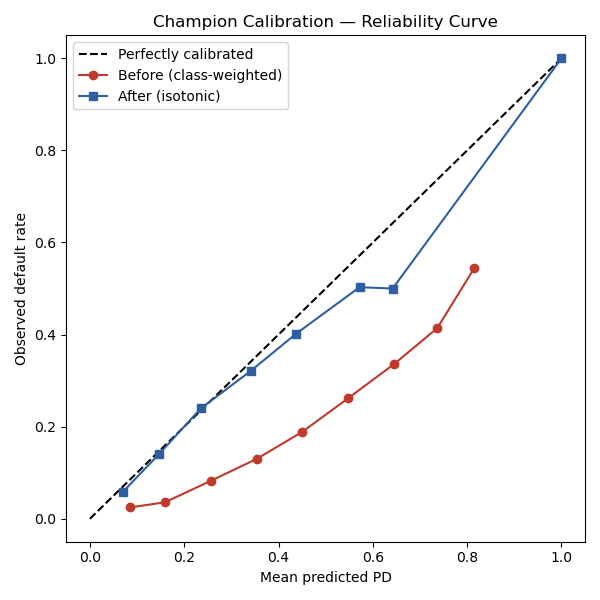
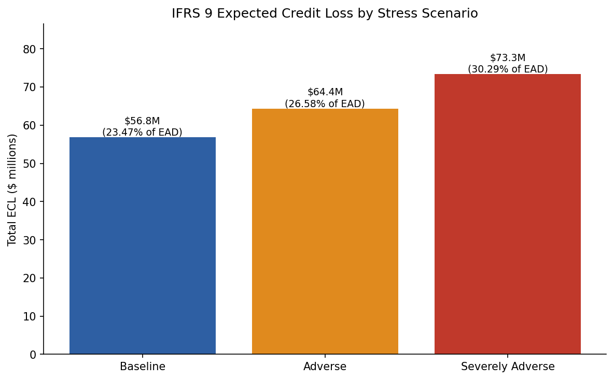

# Consumer Credit Risk Modelling
### Loan Default Prediction with Canadian Macroeconomic Stress Testing for Credit Union Decision Support

A complete, decision-ready credit risk pipeline that predicts borrower default, calibrates those predictions into valid probabilities of default (PD), and translates them into **IFRS 9 Expected Credit Loss (ECL) provisions** under adverse Canadian macroeconomic scenarios — the figure a credit union risk committee must actually hold against its book.

> **Headline results:** Out-of-time test AUC **0.6726** · calibrated Brier **0.1576** (beats the 0.1676 base-rate benchmark) · baseline ECL **$56.8M (23.5% coverage)** · provisions rise **+15.5%** under a GFC-replay shock and **+29.0%** under a severe shock.



*The model's risk drivers are economically meaningful: FICO score, loan-to-income, and debt-to-income dominate predicted default risk.*

---

## Table of Contents
1. [Problem Statement](#1-problem-statement)
2. [Data](#2-data)
3. [Method & Architecture](#3-method--architecture)
4. [Data Wrangling](#4-data-wrangling)
5. [Exploratory Data Analysis](#5-exploratory-data-analysis)
6. [Feature Engineering & Pre-processing](#6-feature-engineering--pre-processing)
7. [Modelling](#7-modelling)
8. [Model Explainability (SHAP)](#8-model-explainability-shap)
9. [Results: IFRS 9 Stress Testing](#9-results-ifrs-9-stress-testing)
10. [Future Improvements](#10-future-improvements)
11. [Repository Structure](#11-repository-structure)
12. [Credits & Contact](#12-credits--contact)

---

## 1. Problem Statement

Since 2018, IFRS 9 has required lenders to hold **forward-looking** provisions for expected credit losses, scaled to credit deterioration and informed by macroeconomic scenarios. Institutions without internal PD models fall back on a flat, portfolio-average reserve rate — which over-provisions safe borrowers, under-provisions risky ones, and offers no way to translate an economic scenario into a provision number.

**This project asks:** can a leakage-free model, trained only on information available at loan origination, produce calibrated PDs accurate enough to (a) support IFRS 9 staging and (b) quantify how provisions change under adverse Canadian macro scenarios — giving a credit union a defensible, explainable alternative to flat-rate reserving?

**Intended client:** the credit risk function of a Saskatchewan credit union or community lender (CRO, credit committee, finance, and model governance).

---

## 2. Data

| Source | Description | Coverage |
|---|---|---|
| [LendingClub accepted loans](https://www.kaggle.com/datasets/wordsforthewise/lending-club) | Borrower application, credit profile, loan outcome | 2007–2018, 2.26M loans × 151 cols |
| Bank of Canada Valet API | Overnight policy rate (V39079 + legacy V122530) | 2000–2026, monthly |
| Statistics Canada | Unemployment (14-10-0287), CPI (18-10-0004), Debt-Service Ratio (11-10-0065), Consumer Insolvencies (v41690973) | 2000–2026, monthly |

After resolving outcomes, **1,345,350 loans** form the modelling base (19.96% default rate). The Canadian macro panel (**318 months × 6 indicators**, zero nulls) is used for scenario design only — **never joined to loan-level data**.

---

## 3. Method & Architecture

A deliberate **three-layer** design:

| Layer | What it does | Notebooks |
|---|---|---|
| **Layer 1 — Micro credit risk** | Borrower-level PD model on LendingClub data | 01–05 |
| **Layer 2 — Macroeconomic risk** | Canadian economic conditions and stress-scenario design | 01, 02 |
| **Layer 3 — Integrated risk** | IFRS 9 ECL + macro stress overlay at the portfolio level | 06 |

**Critical rule:** the layers meet only at the portfolio, never at the loan row. US borrower records carry no economically meaningful row-level link to Canadian indicators, so the macro panel informs scenario design exclusively.

---

## 4. Data Wrangling

- **Target construction** — kept only fully resolved loans (Fully Paid / Charged Off / Default); built binary `default_flag`.
- **Two-tier leakage control** — `LEAKAGE_COLUMNS` (22 post-outcome fields) dropped entirely; `MODEL_EXCLUDED_COLUMNS` (`grade`, `sub_grade`, `int_rate`) kept for EDA but never modelled (avoids circular prediction on the lender's own risk score).
- **Cross-vintage feature audit** — classified every column by missingness across vintages (CONSISTENT / PARTIAL / LATE_ADDED / SPARSE); 89 SPARSE dropped, leaving 32 temporally stable candidates. Governance exported to `consistent_features.json`.
- **Two-stage stratified sampling** — 100k dev sample (iteration) + 500k production sample (final benchmark), stratified on `issue_year × default_flag`.
- **Macro panel build** — five series acquired via API with chunked ingestion + retry logic, standardized to a monthly panel.

---

## 5. Exploratory Data Analysis

| | |
|---|---|
|  | Default rates climb from ~13% (2008–09, crisis-tightened) to ~23% (2016–17, looser standards). **Vintage matters at the year level**, not quarter. |

Key findings: lender grade is strongly monotonic with default (confirming exclusion is necessary); loan purpose separates risk (small business 27.7% vs car 16.0%); defaulted loans show higher DTI/rates and lower FICO; **all individual correlations are weak** (FICO −0.129, DTI +0.093) — default is non-linear and multi-factor, motivating tree models over a linear baseline.

---

## 6. Feature Engineering & Pre-processing

- **15 origination-time features** in five families (affordability, credit quality, derogatory flags, employment, loan/vintage context), produced by one `engineer()` function applied identically to dev and production.
- **Continuous over binned** — DTI, FICO, and revolving utilization enter raw, not banded; binning discarded signal and lowered performance.
- **Encoding** — `OrdinalEncoder` on the three ordered categoricals (fit on train only). Ordinal chosen over one-hot dummies because the categories are ordered and tree models split on thresholds.
- **Standardization** — `StandardScaler` for Logistic Regression only; tree models use raw values.
- **Temporal split** — train ≤2015 / validate 2016 / test 2017–2018 (out-of-time, prevents vintage leakage).

---

## 7. Modelling

Three models, one evaluation framework. Boosters tuned with seeded, time-boxed (30-min) Optuna searches.

| Model | Val AUC | KS | Gini | Brier |
|---|---|---|---|---|
| **XGBoost (champion)** | **0.6684** | **0.2472** | 0.3367 | **0.2316** |
| LightGBM | 0.6684 | 0.2471 | 0.3369 | 0.2320 |
| Logistic Regression | 0.6616 | 0.2362 | 0.3232 | 0.2368 |

*Base-rate Brier reference: 0.1786.*

**Champion: XGBoost** — ties LightGBM on every discrimination metric but reaches it with 230 trees vs 591 (parsimony) and a marginally better Brier. Two independent searches converging on the same AUC reveals a **feature-set ceiling**, not a tuning limit — the honest cost of excluding the lender's own risk pricing.

| | |
|---|---|
|  |  |
| Validation ROC with policy operating point | Isotonic calibration pulls PDs onto the diagonal |

**Production retrain** on 500k → **out-of-time test AUC 0.6726**, stable across vintages (2017: 0.673, 2018: 0.667 — no material drift). **Isotonic calibration** corrects class-weighted inflation (Brier 0.2254 → **0.1576**) without touching rank order, making the PDs valid for ECL.

---

## 8. Model Explainability (SHAP)

SHAP (TreeExplainer on 5,000 validation loans) confirms the model learns economically meaningful relationships. Globally, FICO / loan-to-income / DTI dominate; directionally, higher leverage raises risk and stronger credit quality lowers it; a near-monotonic FICO dependence plot shows a learned pattern, not isolated thresholds; and loan-level waterfall plots give the auditable, per-borrower rationale required for adverse-action notices and model governance.

---

## 9. Results: IFRS 9 Stress Testing

`ECL = PD × LGD × EAD`, three-stage classification, one shared `stage_and_ecl()` function across baseline and all scenarios (a regression assert confirms zero-shock reproduces baseline exactly).

**Baseline allowance** on the $242.1M test portfolio:

| Stage | Loans | ECL | Coverage |
|---|---|---|---|
| Stage 1 — Performing | 10,687 | $10.8M | 7.99% |
| Stage 2 — SICR | 2,514 | $20.7M | 41.05% |
| Stage 3 — Credit-impaired | 3,571 | $25.3M | 45.00% |
| **Total** | **16,772** | **$56.8M** | **23.47%** |

A naive flat-rate reserve would hold only $23.2M — the model adds **$33.6M of risk-differentiated provisioning**.

**Stress overlay** (shocks anchored in Canadian history — +2.7pp = exact GFC replay; +4.5pp = beyond-sample severe):



| Scenario | Shock | Total ECL | ECL vs baseline | Stage 2 loans |
|---|---|---|---|---|
| Baseline | +0.0pp | $56.8M | +0.0% | 2,514 |
| Adverse | +2.7pp | $65.6M | **+15.5%** | 3,537 |
| Severely Adverse | +4.5pp | $73.3M | **+29.0%** | 5,022 |

Provisions rise mainly through **Stage 1 → Stage 2 migration** (the lifetime-ECL population roughly doubles under severe stress) — the non-linear behaviour IFRS 9's point-in-time staging is built to capture.

---

## 10. Future Improvements

- **Lift the feature-set ceiling** with bureau trade-line, behavioural, or alternative data — the 0.667 plateau is a data constraint, not a model one.
- **Model the lifetime PD term structure** with survival analysis (replacing the 2.5× approximation).
- **Estimate the macro elasticity** from vintage-level default rates rather than assuming 10%/pp.
- **Production hardening** — PSI monitoring, scheduled recalibration, champion–challenger governance, fairness testing.
- **Canadian-native validation** on domestic credit-union loan performance.

---

## 11. Repository Structure

```
consumer-credit-risk-modelling/
├── notebooks/
│   ├── 01_data_preparation.ipynb            # acquisition, target, leakage, vintage audit, sampling, macro panel
│   ├── 02_eda_loans_macros.ipynb            # borrower + macro EDA
│   ├── 03_feature_engineering_preprocessing.ipynb  # engineer(), 15 features, split, encoding
│   ├── 04_modeling.ipynb                    # 3 models, tuning, champion, threshold, retrain, drift, calibration
│   ├── 05_model_explainability.ipynb        # SHAP global / directional / dependence / waterfall
│   └── 06_stress_testing_and_ecl.ipynb      # IFRS 9 staging, baseline ECL, macro stress overlay
├── data/processed/                          # parquet splits, macro_panel, consistent_features.json
├── models/                                  # champion_xgb_production.pkl, champion_xgb_calibrated.pkl, encoder, feature_list
├── report/
│   ├── figures/                             # all saved charts
│   ├── final_report.pdf                     # full project report
│   └── model_metrics.md                     # model metrics summary
└── README.md
```

**Reproducibility:** all random ops seeded (`random_state=42`); Optuna uses seeded TPE samplers. Run notebooks 01 → 06 in order.

---

## 12. Credits & Contact

**Author:** Michael Ikechukwu Jumbo — banking & compliance professional (18+ yrs) applying data science to credit risk problems.
Springboard Data Science Career Track — Capstone Three, June 2026.

**Data:** LendingClub (via Kaggle), Bank of Canada, Statistics Canada.
**Tools:** Python · pandas · scikit-learn · XGBoost · LightGBM · Optuna · SHAP · matplotlib.
